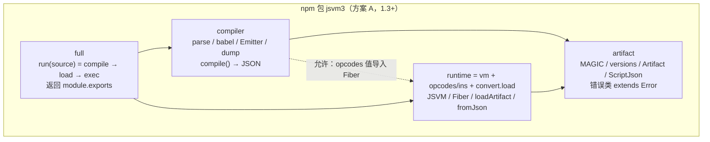
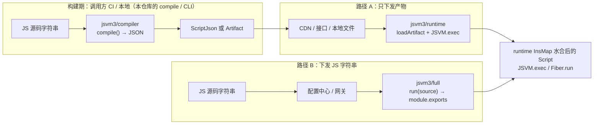
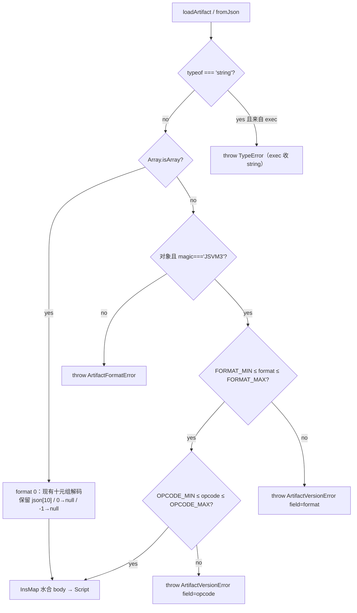
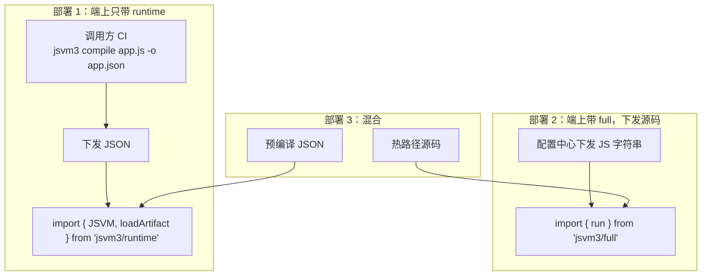
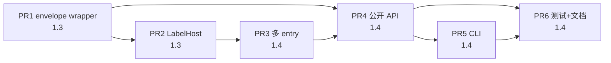

# jsvm3 构建能力 / 运行时分离设计

| 字段 | 值 |
| --- | --- |
| 文档标题 | 构建能力与运行时物理分离 |
| 作者 | jsvm3 maintainers |
| 日期 | 2026-08-16 |
| 状态 | Draft |
| 仓库 | `/Users/ximing/project/mygithub/jsvm3` |
| 当前包名 / 版本 | 仓库今天是 `jsvm2@1.2.5`。本设计从 **1.3.0 起发布新包 `jsvm3`**（Q1 已决）。所有新 API / `exports` / `bin` 写 `jsvm3/*`。 |

---

## Overview

jsvm3 今天是一个**单包、单入口**的 JS 解释器：`@babel/core` + `@babel/parser` + minify 插件 + 自研 `Emitter` 在同一颗依赖树里，和 `JSVM.exec` 一起发布。端上即便只用 `fromJson` + `exec`，`npm install` 仍会拉下整棵 Babel 栈；产物 JSON 没有 magic / format / opcode 版本；源码字符串路径没有稳定的高层 API（`eval` / `compileFunction` 在 `src/vm/vm.ts` 里被整段注释）。

本设计把仓库切成四条**逻辑边界**（`artifact` / `runtime` / `compiler` / `full`），物理上先留在同一 npm 包内，**从 1.3.0 起包名为 `jsvm3`**（现网 `jsvm2@1.2.5` 不再承载本列车）。v1 采用 **M3 + 弱 DAG**（见 KD-2、Alternatives）：`artifact` 只放信封类型与版本常量；`loadArtifact` / `fromJson` 留在 runtime（`src/utils/convert.ts`）；`dump` 留在 convert / compiler。工业保证是「runtime 入口与 2.0 安装闭包不含 Babel」，**不是**「compiler 的 `.ts` 图里看不到 `Fiber`」。

两条下发路径都是一等公民，**跨入口的唯一合法通货是 JSON**（format 0 数组或 format 1 信封），两端都经 runtime 的 `InsMap` 水合后再 `JSVM.exec(script)`：

- **路径 A**：离线/服务端 `compile(js) → ScriptJson | Artifact`，端上 `loadArtifact(...) → exec`。端上零 Babel。
- **路径 B**：端上或网关拿到 JS 字符串，走 `jsvm3/full` 的 `run(source)`（内部仍是 compile → JSON → load → exec），返回 `module.exports`。

第一阶段不拆 workspace 多包。若 2.0 optional peer 仍不够，再升 `@jsvm3/runtime` + `@jsvm3/compiler`。

---

## Background & Motivation

### 当前事实（已对照源码核实）

仓库仍是单包。`package.json`：`name: "jsvm2"`，`version: "1.2.5"`，`main: dist/index.js`，`module: dist/es.es6.js`，`types: dist/index.d.ts`（**该文件不存在**，实际类型在 `lib/index.d.ts`），`files: ["lib", "dist"]`，`engines.node: ">=10"`。

公开入口：

```1:2:src/index.ts
export * from './vm';
export { fromJson } from './utils/convert';
```

`src/exp.ts` 与之相同。`src/vm/index.ts` 只 `export * from './vm'`。`JSVM` 目前只有 `exec` / `createFiber`：

```15:28:src/vm/vm.ts
  exec(script: Script, timeout = -1) {
    const fiber = this.createFiber(script, timeout);
    fiber.run();
    if (!fiber.suspended) {
      return fiber.rexp;
    }
  }

  createFiber(script: Script, timeout = -1) {
    const fiber = new Fiber(this.realm, timeout);
    fiber.pushFrame(script, this.realm.globalObj);
    return fiber;
  }
```

编译器 `src/compiler/index.ts#transform` 的真实流水线是：

1. 可选 `@babel/preset-env`（targets `safari >= 9, android >= 4.4`，一长串 `assumptions`）把源码降到 ES5。
2. minify 插件（`minify-dead-code-elimination` / `minify-constant-folding` / `minify-guarded-expressions`）+ 自研 `plugin/hoisting`。
3. `@babel/parser` 出 AST，`Emitter.visit` 后 `Emitter.end()` 返回 `Script`。

预设/插件今天按**字符串名**交给 `babel.transformSync`。`@babel/preset-env` **只写在 `devDependencies`**，却被 `transform` 在运行时解析。从 `lib/compiler` 能编过，是因为本仓库自己装了 devDep；pnpm isolated 下这是经典的 `Cannot find module '@babel/preset-env'`。

构建现状：

| 产物 | 怎么来的 | 体积（2026-08-16 实测） | 含不含 Babel |
| --- | --- | --- | --- |
| `dist/index.js` | `rollup.config.js`，`input: src/index.ts`，preprocess `{ VM: true, CURRENT: 'all' }` | **12 337 B** / gzip **4 348 B** | 不含（入口不 import compiler；`@ifdef COMPILER` 被剥掉） |
| `dist/es.es6.js` | 同上 ESM | 12 269 B / gzip 4 318 B | 不含 |
| `dist/exp.js` | `rollup.exp.config.js`，`CURRENT: 'exp'` | 8 318 B | 不含 |
| `lib/**` | `tsc`（`build-compiler`） | **约 576 KB**（589 408 B） | **含** compiler + 对 `@babel/*` 的 require |

`rollup-plugin-preprocess` **没有**定义 `COMPILER`，所以 `dist/` 里 `Script.toJSON` / `source` / `createOP.name` 都被裁掉。`lib/` 是无条件 `tsc`，这些符号都在。两端行为已经不一致。`@ifdef` **不是** TypeScript 模块边界：`tsc` / 未预处理的 `rollup-plugin-dts` 仍能看见真实 `import` 行。

依赖问题比 bundle 更严重。`dependencies` 挂了整棵 Babel 栈：

| 包 | pnpm store 体积（本机） |
| --- | --- |
| `@babel/core@7.29.7` | 1.1 MB |
| `@babel/parser@7.29.8` | 1.9 MB |
| `@babel/types@7.29.8` | 3.1 MB |
| `@babel/helper-hoist-variables` | 20 KB |
| 三个 minify 插件 | ~100 KB |
| 加上 `@babel/core` 的传递依赖 | 安装闭包远大于上表 |

即使业务方只 `fromJson` + `new JSVM().exec()`，今天的 `npm i jsvm2` 仍会装 Babel。`exports` 子路径解决不了「安装闭包」——npm 的依赖是包级的。**`jsvm3@1.3` / `1.4` 也不改变这一点（Babel 仍在 `dependencies`）。Goal 2（`npm i jsvm3` 不带 Babel）只在 2.0 落地。**

产物格式（`src/utils/convert.ts`）是无版本紧凑数组：

```
[fName, name, instructions, children, localNames, guards, stackSize, strings, regexps, globalNames]
```

- `fromJson` 仍读 `json[10]` 作为 `source`（`!== 0` 则用，否则 `null`）。`scriptToJson` **从不写**下标 10；注释掉的 `rv[9] = script.source` 若启用会**覆盖 `globalNames`**。format 0 必须保持「十元组 ⇒ `source` 为 `null`/`undefined`」，禁止「修正」到 `[9]` 或 `[10]`。
- **没有 magic、没有 format version、没有 opcode version**。opcode id 换号或增删指令，旧 JSON 会 silently 解成错误的 `InsMap` 工厂，或 `InsMap.get` 得到 `undefined` 后在 `insFun!(...)` 处炸。
- `fromJson` 的参数类型是 `any`，无校验。
- `__tests__/fromJson.test.ts` 只覆盖字面量加法与嵌套函数，**没有** `regexps[8]`、`guards[5]`、`globalNames[9]`、`json[10]`。
- `regexpToString` 只编码 `g|i|m`（无 `u`/`s`/`y`/`d`）；`lastIndexOf('/')` 在 `source` 含 `/` 时会切错。这是已知有损编解码，冻结进 format 1 `body[8]` 前必须写明（见 Data Model）。

测试路径：

- `__tests__/helper.ts`：`transform` + `new JSVM` + `exec`，返回 **`(vm.realm.globalObj as any).module.exports`**，且默认 **`convertES5: false`**。这是路径 B 的雏形，但**不是**将要公开的 `run()` 的默认值。
- `__tests__/fromJson.test.ts`：`transform` → `scriptToJson` → `JSON.parse/stringify` → `fromJson` → `exec`（路径 A 的雏形）。
- 两条路径都已经存在，但都不是稳定公开 API，也没有版本信封。

耦合点（实现时必须按真实图处理，不能假装 LabelHost 就能拆干净）：

| 边 | 文件 | 问题 |
| --- | --- | --- |
| `opcodes → compiler` | `src/opcodes/label.ts` `import type { Emitter }` | 类型环。runtime/opcodes 不该认识 compiler |
| `compiler → opcodes → Fiber` | `emitter.ts` import `../opcodes`（即 `ins.ts`）；`createOP` / `createFunction` 值导入 `Fiber` / `Realm` / `Scope` | **LabelHost 消不掉这条边**。compiler 的 TS 图里会看到 Fiber |
| `convert → InsMap → Fiber` | `fromJson` / `instructionsFromJson` 调 `InsMap.get` | load **必须**留在 runtime，不能进 artifact |
| `opcodes/types → Realm` | `src/opcodes/types.ts` 值导入 `EvaluationStack`、`Realm` | 若把 `Script`（`instructions: Instruction[]`）放进 artifact，artifact 会拖整棵 VM |
| `errors → vm/types` | `JSVMError` 体系 import `Trace` | artifact 错误类不得 `extends JSVMError`，否则 artifact → vm |
| `vm/types → opcodes/label` | `Guard.start: Label \| number` | 运行时 guard 早已是 number（`Emitter.end` 里 `label.ip`） |
| `script.ts` 的 `Guard` | `import { Guard }` 写在 `// @ifdef COMPILER` 块内，但 `guards: Guard[]` 是运行时字段 | 迁类或出 dts 时必须**无条件** import 运行时 `Guard` |
| `convert` 一身二职 | `fromJson`（runtime）+ `scriptToJson`（dump，只需 id） | dump 可不碰 InsMap；load 必须碰 |

已有半成品：`@ifdef COMPILER` / `VM` / `CURRENT` preprocess。缺的是包边界、versioned artifact、以及 `run(source)` 高层 API。

### 痛点

1. **端上装不下、也不该装 Babel。** 浏览器 / 小程序 / 轻量 Node worker 只要解释器；安装闭包和 tree-shake 是两件独立的事。安装闭包要到 2.0 才收得掉。
2. **产物不可演进。** 没有 version，就没有兼容策略，也没有办法对「compiler 2.x 产物 + runtime 1.x」给出具名错误。
3. **字符串路径不是一等公民。** 要跑源码只能直接调 `transform`，没有 `compile` / `run`，也没有 CLI。
4. **公开 API 不稳定。** 入口只导出 `JSVM` + `fromJson`；`types` 字段指向不存在的文件。
5. **安全边界从未写明。** `Realm` 默认注入宿主 `Object` / `Function` / `Promise` / `console`；`new Function(src)` 会在宿主而不是 VM 里执行。

---

## Goals & Non-Goals

### Goals

1. **物理分离（1.4 起可验证）**：runtime **bundle / 入口模块图**不得出现 `@babel/*`、minify 插件、`compiler/visitor`、`compiler/emitter`、`compiler/plugin/*`。compiler 的 TypeScript 图**允许**经过 opcodes 看到 `Fiber`（弱 DAG）。
2. **安装分离（仅 2.0）**：`npm i jsvm3` 默认不把 Babel 装进业务依赖树。1.3 / 1.4 **不**实现本目标（Babel 仍在 `dependencies`）。
3. **路径 A / 路径 B 都是一等公民**。跨 Rollup entry 的唯一通货是 JSON Artifact / ScriptJson；两端经 **runtime `InsMap`** 水合后 `JSVM.exec(script)`。
4. **产物有信封**：magic + format + opcode version；不匹配抛具名错误，禁止 silent coerce。
5. **`fromJson` 继续能加载旧紧凑数组**（1.3 起同时能加载信封），现有下游不破。
6. **公开 API 稳定、带 TypeScript 类型**；按 **exports 子路径**切割，而不是靠包级 `"sideEffects": false` 做 tree-shake。
7. **runtime 体积可量化**：以当前 `dist/index.js` 为基线，1.4 预算见下文。
8. **渐进拆分**：每个 PR 可独立合并，测试保持绿。发布列车与 PR 图必须是同一张表。

### Non-Goals

- 不重写 opcode，不换 Fiber / Frame / Realm 执行模型。
- 不追求把 JS 语义补齐到 ES202x。
- 不引入 WASM / 原生加速。
- 不把沙箱做成完整 SES / lockdown。
- **不**在 1.x 把 Babel 移出 `dependencies`。
- **不**继续在 `jsvm2` 上发 1.3+。现网 `jsvm2@1.2.5` 冻结；本列车发新包 `jsvm3`。
- v1 不做二进制产物。JSON 信封先落地。
- 不在 runtime 里 `import()` 动态拉 Babel。
- **不**把 opcode metadata 与 `run()` 做物理文件拆分（那是 M1，后置）。
- **不**承诺对今天的 `@ifdef` 源做 tsc project reference 出干净 runtime `.d.ts`。runtime 类型从 **Rollup `COMPILER:false` 预处理后的图**生成。
- v1 **不**做 `JSVMDiagnostics` 钩子（具名错误够用；观测钩子单独立项）。
- 不把 hardened Realm 绑进 2.0 安装闭包列车（Q2 已决：默认 Realm 行为不变，只警告非沙箱）。
- **已决（Q3）**：不引入墙钟 `timeoutMs`。`timeout` 只保持现有指令预算。
- **已决（Q4）**：本仓库只交付库 + CLI。不在本仓做编译服务产品，也不加 HTTP compile example。

---

## Key Decisions

### KD-1 分包策略：先做方案 A，预留升 B 的接口

**推荐：方案 A**——继续**一个 npm 包**，**从 1.3.0 起名为 `jsvm3`**，用 `exports` 子路径（`jsvm3/runtime`、`jsvm3/compiler`、`jsvm3/full`、`jsvm3/artifact`、`jsvm3/exp`）+ 独立 Rollup entry。Babel 从 `dependencies` 挪走是 **2.0** 的事，不是方案 A 的第一天。不发明 1.x 的 `jsvm3/runtime` 品牌。

| 方案 | 优点 | 缺点 | 为何不选（或后置） |
| --- | --- | --- | --- |
| **A. 单包 + export map** | 迁移成本最低；测试、CI 不用动 workspace；`fromJson` 兼容期只需一个版本号 | npm 依赖是包级的，必须靠 2.0 optional peer 才能让「只装 runtime」不拉 Babel | **先做这个** |
| B. workspace 多包 | 边界最硬，安装闭包天然干净 | 要同时发 3 个包、对齐 semver、改所有 import | 2.0 optional peer 被证明不够后再升 |
| C. 只定产物约定 + CLI，代码仍混 | 文档成本低 | 解决不了安装闭包、类型环 | 不满足「工业级可用」 |

**为什么 A 够用、不必立刻上 B：**

1. `rollup.config.js` **已经**能打出一份 12 KB、零 Babel 的 runtime bundle。缺的是入口契约、版本信封、高层 API。
2. 当前最大的可立刻切断的环是 `label.ts → Emitter`。`convert → InsMap → Fiber` 和 `emitter → opcodes → Fiber` 用 M3 承认，而不是假装搬文件就能消失。
3. 下游已经在用 `fromJson` + `JSVM`。单包可以在 1.x 做加法，2.0 再动安装闭包。
4. 升 B 的触发条件：① optional peer 导致 compiler 用户装不全 Babel、支持成本过高；或 ② 需要独立 version 的 artifact 包给非 JS compiler 用。

**安装闭包（与发布列车对齐，不在 KD-1 里写死改名）：**

- **1.3 / 1.4**：包名 **`jsvm3`**。Babel **留在 `dependencies`**。现网 `jsvm2@1.2.5` 不再发版承载本列车。
- **2.0.0**：包名仍是 `jsvm3`。Babel 全部移到 `peerDependencies` + `peerDependenciesMeta.optional: true`。默认 `npm i jsvm3` **不会**装 Babel。
- **禁止** runtime 在缺 compiler 时 `import('@babel/core')`。

### KD-2 逻辑模块：M3 + 弱 DAG

v1 **不**追求「compiler 不得 import Fiber / Frame / Realm」。那条硬 DAG 与当前 `opcodes/ins.ts` → `opcodes/utils.ts` → `Fiber` 的值导入矛盾（见 Issue 1 / Alternatives M1–M3）。

**推荐 M3：**



硬约束（可在 CI 里扫）：

| 模块 | 不得 | 允许 |
| --- | --- | --- |
| `artifact` | import `compiler/**`、`vm/**`、`opcodes/ins`、`@babel/*` | 只含常量、接口、`extends Error` 的错误类 |
| `runtime` | import `compiler/**`、`@babel/*` | import artifact；拥有 `InsMap` / `fromJson` / `loadArtifact` |
| `compiler` | import `@babel/*` **从 runtime 再出口**（根本没有这条边） | import artifact；import `opcodes/*`（因此 TS 图里可以出现 Fiber）；调用 `scriptToJson` / `dumpArtifact` |
| `full` | — | 同时依赖 compiler + runtime（Rollup **external** 这两入口，禁止打进第二份 JSVM） |

`Script` **留在** `src/vm/script.ts`，不搬进 artifact。artifact 只描述 JSON 形状。`Script.instructions` 继续用运行时指令对象；若要在共享类型里写「可 dump 的东西」，用结构类型 `{ id: number; args?: unknown[] }`，**不要**引用 `src/opcodes/types.ts` 里那个值导入了 `Realm` 的 `Instruction`。

`loadArtifact` / `fromJson` / `instructionsFromJson` **必须**留在 runtime（现 `src/utils/convert.ts`）。`dumpArtifact` / `scriptToJson` 只读 `id` + `args`，可留在 `convert.ts` 或 compiler，**不要**放进会 import `InsMap` 的 artifact。

runtime `.d.ts`：**从 Rollup、`COMPILER:false` 预处理后的图生成**（preprocess → 再 dts / api-extractor）。不要对今天的 ifdef 源做 tsc project reference 并声称结果干净。

### KD-3 打断 `label.ts → compiler/emitter`（只做这一条环）

`Label` 实际只用了 `emitter.instructions.length`。改成 opcodes 内的最小接口：

```ts
// src/opcodes/label.ts
export interface LabelHost {
  readonly instructions: { readonly length: number };
}

export class Label {
  static id = 1;
  readonly emitter: LabelHost;
  readonly id: number;
  ip: number | null;
  constructor(emitter: LabelHost) { /* ... */ }
  mark(): number {
    return (this.ip = this.emitter.instructions.length);
  }
}
```

同步收紧 `Guard`：

```ts
// 编译期（Emitter 内部，可放 compiler 侧）
export interface CompileGuard {
  start: Label;
  handler: Label | null;
  finalizer: Label | null;
  end: Label;
}

// 运行期（Emitter.end() 已把 Label 换成 ip）
export interface Guard {
  start: number | null;
  handler: number | null;
  finalizer: number | null;
  end: number | null;
}
```

`src/vm/script.ts` 对 `Guard` 必须**无条件** import（今天它在 `@ifdef COMPILER` 块里，但 `guards` 是运行时字段）。

这只去掉 `label.ts → Emitter`。`emitter → opcodes → Fiber` 按 KD-2 保留。预处理后的 runtime `.d.ts` 不应再出现 `compiler/emitter`；未预处理的 `lib/*.d.ts` 在 1.x 仍可能提到 `Label`——以预处理产物为准。

### KD-4 Artifact 格式：信封可选；写出默认按列车切换

```ts
{
  magic: "JSVM3",          // 格式族名；现与 npm 包名 jsvm3 一致，但不随包名再改
  format: 1,
  opcode: 1,
  compiler: "1.4.0",
  filename?: "app.js",
  debug?: { source?: string; maps?: unknown },
  body: [ /* 现有 scriptToJson 十元组，含既有 json[10] 语义 */ ]
}
```

- **v1 坚持 JSON**。二进制后置。
- `fromJson`（1.3 起）加载旧数组 **以及** 信封。新 API `loadArtifact` 是同一实现的别名。
- **写出默认：**
  - **1.3 / 1.4**：`dumpArtifact` / `compile` 默认 `format: 0`，返回值是 **裸 `ScriptJson` 数组**，**绝不是** `{ magic, format: 0, body }`。1.2.5 的 `fromJson` 只能吃数组；信封喂给 1.2.5 会 `json[0] === undefined` 后 silently 建坏 Script（R6）。
  - **2.0**：默认切到 `format: 1` 信封。`format: 0` 仍可作为显式选项写出裸数组。
- `dumpArtifact({ format: 0 })` 的 TypeScript 返回类型是 `ScriptJson`。
- 版本不匹配 → `ArtifactVersionError`（`field` / `expected` / `actual`），禁止 remap。

### KD-5 两条路径的 API 分层；跨入口只认 JSON

| 层 | 入口（1.4+，包名 `jsvm3`） | 有的 API | 没有的 API |
| --- | --- | --- | --- |
| `jsvm3` / `jsvm3/runtime` | 默认 | `JSVM`, `loadArtifact`, `fromJson`, `exec` | `compile`, `run`, `transform`, `compileToScript` |
| `jsvm3/compiler` | 构建期 | `compile` → JSON、`dumpArtifact`、`transform`（compat，见下） | `JSVM`、**不**导出 `compileToScript` |
| `jsvm3/full` | 字符串路径 | `run`、`FullJSVM`；测试向的 `compileToScript` | — |
| `jsvm3/artifact` | 共享类型 | `Artifact`、`ScriptJson`、version 常量、错误类 | 执行、Babel、`Script` 类 |
| `jsvm3/exp` | 瘦 Realm | 与 runtime 相同符号，`CURRENT:'exp'` | compiler |

**双实例陷阱（选边：不从 compiler 子路径导出活 `Script`）：**

`compileToScript` / `transform` 返回的 `Script` 带着 **本图** `createOP` 闭包里的 `run` 与 `new Fiber`。`jsvm3/compiler` 与 `jsvm3/runtime` 分成两个 Rollup entry 之后，

```ts
import { compileToScript } from 'jsvm3/compiler'; // 1.4 起此导出不存在
import { JSVM } from 'jsvm3/runtime';
vm.exec(compileToScript(src)); // 两份 Fiber / InsMap
```

是未定义行为。因此：

1. **`jsvm3/compiler` 的公开产出只有 JSON**（`compile()` / `dumpArtifact()`）。
2. **`JSVM.exec` 对 Artifact / 数组始终经 runtime `InsMap` 水合。** 对已经是本 bundle 的 `Script`（测试、`full` 内部若同图）直接跑。
3. **JSON 是唯一受支持的跨 entry 通货。** 文档写明：不要把 compiler bundle 里的 `Script` 丢给 runtime `exec`。
4. 仓内测试继续 `import { transform } from '../src/compiler'` + `import { JSVM } from '../src/vm/vm'`（同一 TS 图，合法）。
5. `transform` 仍从 `jsvm3/compiler` 导出以兼容 `lib/compiler` 用户，但 JSDoc 标：**跨包请 `compile()` + `loadArtifact`；同进程自担双实例风险。** 2.0 起考虑只留 `compile()`。

runtime 的 `exec` **可以**收 `Script | Artifact | ScriptJson`，**不可以**收 `string`。类型拒绝 + 运行时 `TypeError`（见 Call contracts）。

### KD-6 runtime 不内置 compiler

- 端上零 Babel = 只装 / 只打包 runtime，源码在**调用方自己的** CI 里用本仓库的 `compile()` / `jsvm3 compile` 变成 JSON。
- 端上跑字符串 = 显式用 `jsvm3/full`（1.4+；1.x 安装闭包里仍有 Babel，要到 2.0 才「可以不装」）。
- 混合 = 预编译模块走路径 A，热路径走路径 B。
- **不做** runtime 里 `import()` Babel。
- **已决（Q4）**：本仓不提供编译服务、也不放 HTTP compile 示例；业务若要网关，自己用 `jsvm3/compiler` 包一层。

### KD-7 兼容发布：一张表，三个版本

| | **1.3.0** | **1.4.0** | **2.0.0** |
| --- | --- | --- | --- |
| `package.json#name` | **`jsvm3`**（新包；非 `jsvm2` 续发） | `jsvm3` | `jsvm3` |
| 对应 PR | **PR 1–2  only** | **PR 3–6** | 后续独立 PR |
| `main` / `module` | 仍 `dist/index.js` / `dist/es.es6.js` | 同上；内容 = runtime 别名 | `dist/runtime.js` / `dist/runtime.es.js` |
| `types` | 仍坏着或临时指到现有 `lib/index.d.ts`（**不**指到还不存在的 `dist/runtime.d.ts`） | **真实文件**（预处理后的 runtime dts） | 同左 |
| `exports` | **不加**（避免指到不存在的文件；Node 10 也无视它） | `jsvm3`、`jsvm3/runtime`、`jsvm3/compiler`、`jsvm3/full`、`jsvm3/artifact`、`jsvm3/exp` | 同左；根 = runtime only |
| `files` | `lib` + `dist` | `lib` + `dist` | 只 `dist` + 类型；**去掉整棵 `lib/`** |
| `bin` | 无 | `jsvm3` → `dist/cli.js`（**full CLI**，解析 Babel；端上路径 A **不用** CLI） | 同左 |
| `engines` | `node >= 10` | 仍 `>=10`（`main`/`lib` 兜底）；文档写清子路径需要 Node 12+ | **`node >= 16`**（`exports` 成为到达 compiler 的唯一方式） |
| Babel | `dependencies` | `dependencies` | optional peer |
| `fromJson` | 能读数组 **和** 信封 | 同左 | 同左 |
| `compile` / `run` / CLI | **没有**公开新入口 | 有 | 有；根上不再 re-export compiler |
| 默认写出 | 裸数组 format 0 | 裸数组 format 0；`format: 1` 显式 opt-in | 默认信封 format 1 |
| 根导出 | 与 1.2.5 相同 + `loadArtifact` / 错误类（加法） | 可从根 re-export `compile`/`run`（方便试水，实现来自子路径） | 根只有 runtime |

1.3 **没有** `compile`/`run`/`exports`。那是 1.4。改名不等于跳列车：1.3 = 包名 `jsvm3` + 信封 + LabelHost；1.4 才有 `jsvm3/*` 子路径。KD-7、Rollout、PR Plan 必须读成上表。

现网 **`jsvm2@1.2.5` 不是本工作的载体**。`jsvm3@1.3.0` 是新包（版本号沿 1.2.5 表示血缘）。`fromJson` 用户继续用 `jsvm2` 直到主动迁到 `jsvm3`；1.3 的 `fromJson` 仍能加载旧十元组，迁移在 API 上兼容。不发明 1.x `jsvm2/runtime`。

### KD-8 超时与交付物（已拍板）

- **`timeout` 只做指令预算**（与今天 `Fiber.timeout` / `frame.ts` 每条指令 `--` 一致）。本设计不加 `timeoutMs`、不改热循环读时钟。
- **本仓库交付 = 库 + CLI**。不在本仓做编译服务产品或 HTTP compile example。
- **默认 Realm 行为不变**（仍注入宿主 `Object` / `Function` / `Promise` / `console`）。文档与 JSDoc 写明：这不是沙箱；路径 B 等价于在当前进程跑 JS。不新增 `createHardenedRealm()`。

---

## Proposed Design

### 目标架构



### 源码目录（1.3 尽量不搬）

```
src/
  artifact/                 # PR 1 新增：仅类型 / 版本 / 错误
    version.ts
    types.ts                # Artifact, ScriptJson, CompileOptions — 无 Script 类
    errors.ts               # Artifact*Error extends Error（不是 JSVMError）
    index.ts
  utils/convert.ts          # load / dump / fromJson 留在这里（runtime 图）
  vm/script.ts              # Script 类留在这里；无条件 import Guard
  compiler/                 # 现 compiler/；1.4 加 compile()
  opcodes/                  # 共享；PR 2 只改 label / Guard
  full/                     # 1.4 新增
  cli/                      # 1.4 新增
  index.ts                  # 始终 runtime 公开面
  exp.ts                    # CURRENT:'exp'，1.4 进入 exports
```

1.3 / 1.4 **不**把 `vm/` 改名为 `runtime/`。目录重命名另开 PR，避免和契约搅在一起。

### 版本与兼容矩阵

`src/artifact/version.ts`：

```ts
export const ARTIFACT_MAGIC = 'JSVM3' as const;
export const ARTIFACT_FORMAT = 1 as const;
export const OPCODE_VERSION = 1 as const;
export const OPCODE_MIN = 1 as const;
export const OPCODE_MAX = 1 as const;
export const FORMAT_MIN = 0 as const;
export const FORMAT_MAX = 1 as const;
```

| 变化 | 怎么 bump | 旧 runtime 加载新产物 | 新 runtime 加载旧产物 |
| --- | --- | --- | --- |
| 只加 envelope 可选字段 | `format` 不变 | 可以（忽略未知字段） | 可以 |
| 改 `body` 布局、改 magic 语义 | `format += 1`，加 loader 分支 | `ArtifactVersionError` | 若 `FORMAT_MIN` 覆盖则可以 |
| **新增** opcode | `OPCODE_VERSION += 1`，`OPCODE_MAX += 1` | 旧 runtime 拒收 | 可以 |
| **删除 / 改 id / 改 arity / 改语义** | `OPCODE_MIN = OPCODE_MAX = 新值` | 拒收 | 拒收 |
| 只改降级 / hoisting / targets | 只改 `compiler` 字符串 | 可以 | 可以 |
| 包版本号 | 写进 `compiler`，不参与拒绝 | — | — |

加载算法（实现于 `src/utils/convert.ts`，**不是** `src/artifact/load.ts`）：



`InsMap.get(id)` 若 `undefined`：抛 `ArtifactLoadError`，不要 `!` 断言。

旧数组视为 `format = 0`、`opcode = 1`。ISA breaking 之前必须先让生态能写 format 1（1.4 opt-in，2.0 默认）。

`scriptToJsonObject`（`JSVM_DEBUG`）不是稳定加载格式。

### 构建与 `exports`（1.4 起；2.0 再动 peers）

1.4 `package.json` 关键字段（**name 是 `jsvm3`**；1.3 已改名，但 1.3 还不加 `exports`）：

```json
{
  "name": "jsvm3",
  "main": "./dist/index.js",
  "module": "./dist/es.es6.js",
  "types": "./dist/runtime.d.ts",
  "sideEffects": [
    "./dist/index.js",
    "./dist/es.es6.js",
    "./dist/runtime.js",
    "./dist/runtime.es.js",
    "./dist/exp.js",
    "./dist/exp.es6.js",
    "./src/opcodes/ins.ts",
    "./lib/opcodes/ins.js"
  ],
  "bin": { "jsvm3": "./dist/cli.js" },
  "exports": {
    ".": {
      "types": "./dist/runtime.d.ts",
      "import": "./dist/runtime.es.js",
      "require": "./dist/runtime.js"
    },
    "./runtime": { "types": "./dist/runtime.d.ts", "import": "./dist/runtime.es.js", "require": "./dist/runtime.js" },
    "./compiler": { "types": "./dist/compiler.d.ts", "import": "./dist/compiler.es.js", "require": "./dist/compiler.js" },
    "./full": { "types": "./dist/full.d.ts", "import": "./dist/full.es.js", "require": "./dist/full.js" },
    "./artifact": { "types": "./dist/artifact.d.ts", "import": "./dist/artifact.es.js", "require": "./dist/artifact.js" },
    "./exp": { "types": "./dist/exp.d.ts", "import": "./dist/exp.es6.js", "require": "./dist/exp.js" },
    "./package.json": "./package.json"
  }
}
```

**禁止**包级 `"sideEffects": false`。每个 opcode 是 `export const ADD = createOP(...)`，`createOP` 靠 `InsMap.set` 注册；路径 A 只 `InsMap.get(id)`，从不引用 `ADD` 这个 export。包级 `sideEffects: false` 会让 Webpack / Metro / Vite 丢掉注册，端上 `loadArtifact` 对「看起来没引用」的 opcode 直接 `ArtifactLoadError`。

补充运行时闸：`src/index.ts` / runtime entry **为副作用**执行 `registerOpcodes()`（`src/opcodes/ins.ts` 导出；函数体内引用全部工厂，或依赖模块顶层 `createOP` 已执行完毕，entry 仍静态 `import './opcodes/ins'`）。CI 在 minify 后的 `dist/runtime.js` 上扫一组已知 id 的 `InsMap.set` / 等价残留，丢了就失败。

再加一条 **bundler 测试**：webpack（或 metro）只 `import { JSVM, loadArtifact } from 'jsvm3/runtime'`，执行一份覆盖面广的 fixture（算术、调用、try/catch、RegExp、闭包），必须跑通。

Rollup 多 entry（1.4）：

| input | preprocess | output | external |
| --- | --- | --- | --- |
| `src/index.ts` | `{ VM: true, COMPILER: false, CURRENT: 'all' }` | `dist/runtime.js` + `dist/index.js`（别名） | 无 Babel |
| `src/exp.ts` | `{ VM: true, COMPILER: false, CURRENT: 'exp' }` | `dist/exp.js` | 无 Babel |
| `src/compiler/index.ts` | `{ COMPILER: true, VM: false }` | `dist/compiler.js` | `@babel/*`、三个 minify 插件（**静态 import 的包名**） |
| `src/full/index.ts` | `{ COMPILER: true, VM: true, CURRENT: 'all' }` | `dist/full.js` | **`jsvm3/runtime`、`jsvm3/compiler`**（禁止内联第二份 JSVM）以及 Babel |
| `src/artifact/index.ts` | — | `dist/artifact.js` | 无 |
| `src/cli/index.ts` | `{ COMPILER: true }` | `dist/cli.js` | Node built-in + 上述包 |

runtime `.d.ts`：对 **预处理后** 的 runtime 图跑 dts，不要直接 `tsc` ifdef 源。runtime 的 `Instruction.name` 在无 `COMPILER` 时应为 **可选** `name?: string`。

compiler 对 Babel：**静态 import 包，并把函数（不是字符串名）传给 `transformSync`**：

```ts
import * as babel from '@babel/core';
import { parse, parseExpression } from '@babel/parser';
import presetEnv from '@babel/preset-env';
import minifyDCE from 'babel-plugin-minify-dead-code-elimination';
import minifyFold from 'babel-plugin-minify-constant-folding';
import minifyGuard from 'babel-plugin-minify-guarded-expressions';
import hoisting from './plugin/hoisting';

babel.transformSync(code, {
  presets: [[presetEnv, { targets: { browsers: ['safari >= 9', 'android >= 4.4'] }, useBuiltIns: false }]],
  plugins: hoisting
    ? [hoisting, [minifyDCE, { keepFnName: true, keepFnArgs: true, keepClassName: true }], minifyFold, minifyGuard]
    : [minifyDCE, minifyFold, minifyGuard],
  configFile: false,
  babelrc: false,
});
```

2.0 缺 peer 时，失败点是 `require('jsvm3/compiler')` 的模块解析，**不是** `compile()` 内部的漂亮 `CompileError`。文档写清 `npm i -D` 清单即可。不要再承诺 `compile()` 里 `assertCompilerPeers()`——静态 import 到不了函数体。

CI（2.0 必须有；1.4 可先用 `jest moduleNameMapper` 模拟「runtime 图碰不到 `@babel/*`」）：

1. 打包 tarball，**不**装 Babel，断言 `require('jsvm3')` / `jsvm3/runtime` 能 `loadArtifact` + `exec`。
2. 再装 compiler peers，跑 `compile()` + 路径 B。

`lib/`：1.3 / 1.4 继续发布（`benchmark/jsvm3.js`、`demo` 的 deep import）。2.0 从 `files` 去掉。1.4 给这些内部调用加一行注释 / 文档别名，指向 `jsvm3/compiler`。

### 路径 B 的三种部署



上图「调用方 CI」指业务自己的流水线调用本仓库的 `jsvm3 compile` / `compile()`，不是本仓要交付的服务。本仓库只给库 + CLI（Q4 已决）。业务若在网关编译，自行用 `jsvm3/compiler` 包一层，文档不提供 HTTP example。

### CLI（1.4，单一 full bin）

```
jsvm3 compile <input.js> -o <out.json> [--format 0|1] [--no-hoisting] [--no-es5] [--debug] [--filename name]
jsvm3 run <artifact.json>     # 同一 bin 内调 runtime API；进程仍可能解析 compiler 图
jsvm3 eval <input.js>         # compile + run，返回/打印 module.exports
```

**不**声称「`jsvm3 run` 在 Babel-free 机器上可启动」。一个 `bin` 且构建带 `COMPILER: true` 时，装 CLI = 装 full。路径 A 的设备端用库，不用 CLI。若未来要 Babel-free 的 `jsvm3-run`，另开 bin，不在 v1。

1.4 CLI 默认 `--format 0`（与 `compile()` 一致）。2.0 默认 `--format 1`。

### 体积预算（1.4 runtime）

| 产物 | 当前 | 1.4 目标 |
| --- | --- | --- |
| `dist/index.js` / `dist/runtime.js` min | 12 337 B | **≤ 15 KB** |
| 同上 gzip | 4 348 B | **≤ 6 KB** |
| `dist/exp.js` | 8 318 B | ≤ 10 KB |
| compiler / full | 未单独 bundle | 不设上限；Babel external |

CI：gzip 门禁 + Babel 字符串扫描 + `InsMap` 注册残留扫描。

---

## API / Interface Changes

### 共享类型（`src/artifact`，1.4 起 `jsvm3/artifact`）

```ts
export const ARTIFACT_MAGIC = 'JSVM3';
export const ARTIFACT_FORMAT = 1;
export const OPCODE_VERSION = 1;

export type ScriptJson = [
  fName: string | 0,
  name: string | 0,
  instructions: Array<Array<number | string | null>>,
  children: ScriptJson[],
  localNames: unknown[],
  guards: Array<[number, number, number, number]>,
  stackSize: number,
  strings: unknown,
  regexps: string[],
  globalNames: unknown[],
];
// 解码时仍读取可选的 json[10]（source）；写出 format 0 不写该槽。

export interface Artifact {
  readonly magic: typeof ARTIFACT_MAGIC;
  readonly format: number;
  readonly opcode: number;
  readonly compiler: string;
  readonly filename?: string;
  readonly debug?: { source?: string; maps?: unknown };
  readonly body: ScriptJson;
}

export type ArtifactInput = Artifact | ScriptJson;

export interface CompileOptions {
  filename?: string;
  hoisting?: boolean;    // 默认 true，对齐 transform
  convertES5?: boolean;  // 默认 true，对齐 transform（不是 helper）
  debug?: boolean;
  format?: 0 | 1;        // 1.3/1.4 默认 0；2.0 默认 1
}
```

dump 用的结构类型（不 import `opcodes/types.Instruction`）：

```ts
export interface DumpableInstruction {
  readonly id: number;
  readonly args?: ReadonlyArray<unknown> | null;
}
export interface DumpableScript {
  readonly fName?: string | null;
  readonly name?: string | null;
  readonly instructions: ReadonlyArray<DumpableInstruction>;
  readonly children: ReadonlyArray<DumpableScript>;
  readonly localNames: unknown[];
  readonly globalNames?: unknown[];
  readonly guards: ReadonlyArray<{
    start?: number | null;
    handler?: number | null;
    finalizer?: number | null;
    end?: number | null;
  }>;
  readonly stackSize: number;
  readonly strings: unknown;
  readonly regexps: ReadonlyArray<RegExp>;
}
```

### 错误类

**不要** `extends JSVMError`（`src/utils/errors.ts` 值导入 `../vm/types` 的 `Trace`，且 **`JSVMError` 本身不 `extends Error`**，`instanceof Error` 为 false，部分 APM 会丢）。

```ts
// src/artifact/errors.ts
export class ArtifactFormatError extends Error {
  readonly code = 'ARTIFACT_FORMAT' as const;
  readonly expected?: unknown;
  readonly actual?: unknown;
  readonly display = 'ArtifactFormatError';
  constructor(message: string, expected?: unknown, actual?: unknown) {
    super(message);
    this.name = 'ArtifactFormatError';
    this.expected = expected;
    this.actual = actual;
  }
}

export class ArtifactVersionError extends Error {
  readonly code = 'ARTIFACT_VERSION' as const;
  readonly field: 'format' | 'opcode';
  readonly expected: string;
  readonly actual: string;
  readonly display = 'ArtifactVersionError';
  constructor(message: string, field: 'format' | 'opcode', expected: string, actual: string) {
    super(message);
    this.name = 'ArtifactVersionError';
    this.field = field;
    this.expected = expected;
    this.actual = actual;
  }
}

export class ArtifactLoadError extends Error {
  readonly code = 'ARTIFACT_LOAD' as const;
  readonly display = 'ArtifactLoadError';
  constructor(message: string) {
    super(message);
    this.name = 'ArtifactLoadError';
  }
}

export class CompileError extends Error {
  readonly code = 'COMPILE_ERROR' as const;
  readonly filename?: string;
  readonly display = 'CompileError';
  constructor(message: string, filename?: string, options?: { cause?: unknown }) {
    super(message);
    this.name = 'CompileError';
    this.filename = filename;
    if (options?.cause !== undefined) (this as { cause?: unknown }).cause = options.cause;
  }
}
```

执行期错误继续用现有 `JSVMError` 子类（`JSVMTimeoutError` 等），以便 `Fiber.injectStackTrace` 写 `_trace`。加载/编译失败走上面的 `Error` 子类，**不**走 Fiber 注入。若将来要统一，先把 `JSVMError extends Error` 做成独立 breaking，不绑这次拆包。

### Call contracts

#### `loadArtifact` / `fromJson`（runtime，1.3 起）

| | |
| --- | --- |
| 入参 | `unknown`：十元组 **或** `magic==='JSVM3'` 的信封 |
| 成功 | `Script`（`run` 来自 **本 runtime** `InsMap`） |
| 抛 | `ArtifactFormatError` / `ArtifactVersionError` / `ArtifactLoadError` |
| 十元组语义 | 与今天 `fromJson` 逐字段一致，含 `json[10]`、`0 → null`（fName/name/source）、`-1 → null`（guard 槽） |

`fromJson` 标 `@deprecated`，实现 `= loadArtifact`。

#### `dumpArtifact`（convert / compiler，1.3 内部可用，1.4 公开）

```ts
export function dumpArtifact(
  script: DumpableScript,
  options?: { format?: 0 | 1; filename?: string; debug?: boolean; compiler?: string }
): ScriptJson | Artifact;
```

| `options.format` | 返回 | 1.2.5 `fromJson` |
| --- | --- | --- |
| `0` / 缺省（1.3/1.4） | `ScriptJson` 裸数组 | 能加载 |
| `1` | `Artifact` 信封 | **不能**；禁止把信封假装成 format 0 |

#### `compile`（`jsvm3/compiler`，1.4）

```ts
export function compile(source: string, options?: CompileOptions): ScriptJson | Artifact;
```

实现 = 今天的 `transform` + `dumpArtifact`。默认 `hoisting: true`、`convertES5: true`（对齐 `transform`，**不是** helper）。Babel / parse / emit 失败 → `CompileError`，`cause` 保留。1.4 默认 `format: 0`。

`transform` / `transformEXP` 保留，签名不变。不导出 `compileToScript`。

#### `JSVM`（runtime）

```ts
export interface JSVMOptions {
  timeout?: number;   // 指令预算，默认 -1。不是 wall-clock
  maxDepth?: number;  // 默认 1000
}

export class JSVM {
  realm: Realm;
  readonly defaultTimeout: number;
  readonly maxDepth: number;

  constructor(host?: Record<string, unknown>, options?: JSVMOptions);

  exec(input: Script | ArtifactInput, timeout?: number): unknown;
  createFiber(script: Script, timeout?: number): Fiber;
}
```

接线（今天没有构造器选项，必须写死）：

1. 构造：`this.defaultTimeout = options?.timeout ?? -1`，`this.maxDepth = options?.maxDepth ?? 1000`，`this.realm = new Realm(host ?? {})`。
2. `createFiber(script, timeout = this.defaultTimeout)`：`new Fiber(this.realm, timeout)`，然后 **`fiber.maxDepth = this.maxDepth`**（覆盖 `fiber.ts` 里写死的 1000）。
3. `exec(input, timeout?)`：
   - `typeof input === 'string'` → **`throw new TypeError('JSVM.exec does not accept source strings; use jsvm3/full run() or compile() + loadArtifact()')`**（类型与运行时双拒绝）。
   - `isArtifact(input) || Array.isArray(input)` → `script = loadArtifact(input)`（永远走 runtime `InsMap`）。
   - 否则视为本 bundle 的 `Script`，直接跑（测试 / 同图）。
   - `const fiber = this.createFiber(script, timeout ?? this.defaultTimeout)`；`fiber.run()`。
   - 若 `fiber.timedOut()` / `JSVMTimeoutError`：已由 `Fiber.run` 抛出。
   - 若 `fiber.suspended`（`PAUSE` / `YIELD` / 主动 suspend）：**返回 `undefined`，不抛**（与今天 `exec` 一致）。需要句柄时用 `createFiber`。
   - 否则返回 `fiber.rexp`。

`exec` 的返回值仍是「最后表达式」`rexp`，不是 `module.exports`。路径 A 示例自己读 `vm.realm.globalObj.module.exports`。

#### `run` / `FullJSVM`（`jsvm3/full`，1.4）

```ts
export interface RunOptions extends CompileOptions, JSVMOptions {
  host?: Record<string, unknown>;
}

/** 返回 realm.globalObj.module.exports，对齐 helper，而不是 exec 的 rexp */
export function run(source: string, options?: RunOptions): unknown;

export class FullJSVM extends JSVM {
  run(source: string, options?: CompileOptions & { timeout?: number }): unknown;
}
```

| | |
| --- | --- |
| 实现 | `const json = compile(source, options)` → `const vm = new JSVM(options?.host, options)` → `vm.exec(json, options?.timeout)` → **`return vm.realm.globalObj.module.exports`** |
| `convertES5` 默认 | `true` |
| timeout 优先级 | `run({ timeout })` > `JSVMOptions.timeout` > `-1` |
| `fiber.suspended` | **仍返回当时的 `module.exports`**（helper 也不看 `rexp`）。不把 suspend 当成失败。超时 / 执行错误照常抛 |
| 跨 entry | `compile` 的 JSON + runtime `exec` 水合，不会把 compiler 的 `Fiber` 带进 runtime |

**测试 helper 保持薄封装，不改默认值：**

```ts
// __tests__/helper.ts — 不要改成直接 re-export 公开 run()
export const run = function (code, ctx = {}, hoisting = true, convertES5 = false) {
  const script = transform(code, 'test.js', { hoisting, convertES5 });
  const vm = new JSVM(Object.assign({ Map, WeakMap, Set, Proxy }, ctx));
  vm.exec(script);
  return (vm.realm.globalObj as any).module.exports;
};
```

公开 `run` 默认 `convertES5: true`；套件继续走 helper 的 `false`。PR 4 **不得**把 helper 换成公开 `run` 以免重调字节码。

1.4 根入口**可以** re-export `compile` / `run`（实现来自子路径，根文件不得静态 import `compiler/index.ts` 以免 Webpack 从 `jsvm3` 打进 Babel）。2.0 删除根上这两项。

### 使用示例

路径 A：

```ts
import { JSVM, loadArtifact } from 'jsvm3/runtime';
import artifact from './app.artifact.json';

const vm = new JSVM({ console });
vm.exec(loadArtifact(artifact));
return (vm.realm.globalObj as { module: { exports: unknown } }).module.exports;
```

路径 B：

```ts
import { run } from 'jsvm3/full';

const exports = run(userScript, {
  filename: 'rule.js',
  host: { console },
  timeout: 1_000_000,
  convertES5: true,
});
```

---

## Data Model Changes

### 信封 vs 旧数组

| | format 0 | format 1 |
| --- | --- | --- |
| 形状 | JSON 数组（现 `scriptToJson`） | `{ magic, format, opcode, compiler, filename?, debug?, body }` |
| 写出默认 | **1.3 / 1.4** | **2.0** |
| `dumpArtifact({ format: 0 })` | 返回裸数组 | — |
| `dumpArtifact({ format: 1 })` | — | 返回信封，**不是** `{ format: 0, body }` |
| source | 不写出；加载读 `json[10]`，十元组时为 `null` | 可选 `debug.source` |
| 1.2.5 `fromJson` | 能加载 | **不能**（R6） |

不需要迁移脚本。1.3 `fromJson` 见到非数组且无正确 magic 的对象 → `ArtifactFormatError`，禁止把 `{ magic, body }` 当数组解。

### RegExp 编解码（冻结为兼容面）

format 0 / format 1 的 `body[8]` **继续**用今天的 `regexpToString` / `regexpFromString`：

- 只保存 `source + '/' + (g|i|m)`，丢失 `u` / `s` / `y` / `d` 以及 `lastIndex`。
- `regexpFromString` 用 `lastIndexOf('/')` 切；`source` 含 `/` 时依赖 `RegExp.prototype.source` 的转义。这是已知有损。
- **format 1 不在 v1 修这个 codec**（修了就无法当 format 0 的 body 复用）。若以后要完整 flags，走 `format: 2` + 新槽，不要改 `body[8]` 语义。

PR 1 必须补 fixture：带 `g`/`i` 的字面量、`try/catch` guards、`globalNames`、以及「没有 `[10]` 的十元组 `source === null`」。

### `Script` 内存模型

不改字段，**不搬家**。`guards: Guard[]` 仅 number。`source?` 仍只在 compiler / debug 构建存在。`Emitter.end()` 构造参数列表不变。

### 二进制（非 v1）

`format: 2` 以后再说。不挡拆包。

---

## Alternatives Considered

### 1. 分包：A vs B vs C

见 KD-1。`optionalDependencies` 默认仍会安装，对「不要 Babel」无用。2.0 用 optional peer；不够再升 B。

### 2. 模块切分：M1 / M2 / M3（v1 选边）

这是让 DAG 成立的那条分叉，初稿漏了。

| | M1 物理拆 opcode | M2 compiler 可依赖 runtime | **M3 artifact 仅类型（推荐）** |
| --- | --- | --- | --- |
| 做法 | `opcodes/meta`（id / Label / factor）与 `opcodes/run`（InsMap / Fiber）分成两个文件 | 承认 `compiler → opcodes → Fiber`；只禁止 runtime → compiler / `@babel` | artifact 不放 load/Script；load 留 convert；dump 留 convert/compiler |
| 换来的硬 DAG | compiler 真的可以不看见 Fiber | runtime 不含 Babel；compiler bundle 会带一份 opcodes | 同 M2 的工业保证；PR 1–2 最小 |
| 成本 | 拆 `ins.ts` / `utils.ts` / `createOP`，几乎重写指令模块 | compiler 的 d.ts 仍可能出现 Fiber | compiler 的 TS 图不干净 |
| v1 | 后置。值得在「真要独立 `@jsvm3/compiler` 且不能带 VM」时做 | 可接受，但若再把 load 放进 artifact 仍成环 | **采用。与 M2 的弱 DAG 一起写进 KD-2** |

工业保证写成一句：**「runtime bundle / 2.0 安装闭包没有 Babel」，不是「compiler .ts 零 Fiber import」。**

### 3. `exec` 是否直接收 source string

只收 `Script | Artifact`。源码走 `run` / `full`。类型 + 运行时双拒绝。

### 4. 跨入口活 `Script` vs 只认 JSON

见 KD-5。选「compiler 不导出 `compileToScript` + `exec` 对 JSON 始终水合」。始终水合活 `Script`（即使 `instanceof Script`）会让同图测试白交一轮，且破坏 `__JSVMFun__` 身份；不做。

### 5. 产物：裸数组 vs 信封 vs 二进制

信封是最小增量。写出默认按列车切换，避免 R6。

### 6. opcode 版本：整数 vs hash

v1 用整数。可选 `opcodeHash` 仅 debug warn。

### 7. 条件编译 vs 源码物理拆分

ifdef 继续裁 `name` / `forEachLabel` 体积。契约靠目录 + exports。dts 必须走预处理图。

---

## Security & Privacy Considerations

jsvm3 是**解释器**，不是安全沙箱。路径 B 等价于在同一个 JS 堆里跑宿主代码。

### 信任边界


### 已知逃逸（高）

1. **宿主 `Function` / `eval`。** `src/vm/realm.ts` 25–52 行注入宿主 `Function`、`Object`、`Array`、`Promise`、`console`。`Function('return this')()` 在宿主执行。注释掉的 `eval` / `compileFunction` 堵不住这条路。
2. **host 原样注入。** `callFun`（`src/opcodes/utils.ts` 269–298 行）对非 `__JSVMFun__` 直接 `apply` / `new`。
3. **原型污染。** 访客 `Object` 就是宿主 `Object`。
4. **超时是指令预算**（`frame.ts` 96–97），不是 wall-clock。`timeout = -1` 永远到不了 0。宿主调用内部的死循环拦不住。
5. **`maxDepth = 1000`**（`fiber.ts` 216–218）是唯一递归刹车。
6. **无内存配额。**
7. **正则 ReDoS**：加载期 `new RegExp`。
8. **无签名。** 完整性由运输层负责。

### 本次硬约束

- 不重开 `realm.eval`。
- **这不是沙箱**（Q2 已决）。默认 Realm 继续注入宿主 `Object` / `Function` / `Promise` / `console`。`compile` / `run` / `JSVM` 的 JSDoc 第一句写明：路径 B 等价于在当前进程执行 JS。
- hardening 指南只作为文档（readme 一节即可）：不要注入 `Function` / `eval` / `process` / `require`；生产必须设指令预算；路径 A 校验来源。不实现 `createHardenedRealm()`。
- 不把 hardened Realm 塞进 2.0 安装列车。

### 隐私

默认产物不含源码。`debug.source` opt-in。常量表仍可能有业务字面量。

---

## Observability

### 错误类型 → 日志点

| 事件 | 错误类 / `code` | 字段 | 级别 |
| --- | --- | --- | --- |
| Babel / parse / emit | `CompileError` / `COMPILE_ERROR` | `filename`, `cause` | error |
| magic 不对 | `ArtifactFormatError` / `ARTIFACT_FORMAT` | `expected`, `actual` | error |
| format / opcode 区间 | `ArtifactVersionError` / `ARTIFACT_VERSION` | `field`, `expected`, `actual`, `compiler` | error |
| InsMap 缺 id / 长度 / RegExp | `ArtifactLoadError` / `ARTIFACT_LOAD` | `path` | error |
| 指令预算耗尽 | `JSVMTimeoutError` | `timeoutBudget` | warn |
| 调用栈溢出 | `JSVMError('maximum cStack size.')` | `maxDepth` | error |
| `exec(string)` | `TypeError` | — | error |

v1 **不**做 `JSVMDiagnostics`。调用方 `catch` 后按 `code` / `name` 打点即可。业务侧自己的编译流水线若要 histogram，在库外包装，本仓不提供该服务。

建议指标名（业务侧）：`jsvm_compile_ms`、`jsvm_load_total`、`jsvm_exec_ms`、`jsvm_artifact_opcode`。

---

## Rollout Plan

与 KD-7 **同一张表**。用 semver，不用 feature flag。

### 1.3.0（新包 `jsvm3`）= PR 1–2

- `package.json#name` 改为 `jsvm3`。不在 `jsvm2` 上发 1.3。
- `fromJson` 能读信封；默认写出仍是裸数组。
- `LabelHost` + `Guard` 仅 number。
- **不**改 `main` 形态，**不**加 `exports`，**不**公开 `compile`/`run`/`CLI`。
- Babel 仍在 `dependencies`。
- 回滚：停发 / unpublish `jsvm3@1.3`。已写出的 format 1 只有升过 1.3 `fromJson` 的端能读；1.3 compiler/dump 默认不写 format 1。

### 1.4.0（仍 `jsvm3`）= PR 3–6

- 多 entry + `exports` 为 `jsvm3/runtime` 等；`dist/index.js` 别名 runtime；`lib/` 仍发；`types` 指到真实预处理 dts。
- 公开 `compile` / `loadArtifact` / `run` / CLI；默认 `format: 0`。
- `./exp` 进 map。
- 回滚：`main` 仍指向可用的 `dist/index.js`。
- Node 10 用户继续走 `main` / `lib`；子路径需要能理解 `exports` 的解析器。

### 2.0.0 = 后续 PR

- Babel → optional peer；根 = runtime；`files` 去掉 `lib/`；`engines` ≥ 16；`compile` 默认 format 1。
- **不**在本列车里改 Realm 默认注入（Q2 已决：只警告）。包名已是 `jsvm3`。
- changelog：从 `jsvm2` 迁过来的人，只用 `exec` 则符号不变，import 改为 `jsvm3` / `jsvm3/runtime`；用 `transform` 的人改 `jsvm3/compiler` 并在 2.0 自己装 Babel。
- 回滚网：`2.0.1` 可把 Babel 放回 `dependencies`，不改 API。

### 对现有用户

| 用户 | 1.3（新包 `jsvm3`） | 1.4 | 2.0 |
| --- | --- | --- | --- |
| 仍钉在 `jsvm2@1.2.5` | 无感（本列车不碰该包） | 同左 | 同左；可选日后给 `jsvm2` 打一条 deprecation 指向 `jsvm3`（不在六连 PR） |
| 迁到 `jsvm3` 的 `fromJson` + `exec` | 改 `require('jsvm3')`；旧十元组仍能加载 | 建议 `jsvm3/runtime` | 根仍是 runtime |
| `require('../lib/compiler').transform` | 仓内仍可用 `lib/` | 文档指向 `jsvm3/compiler` | 必须改 import |
| helper 模式 | 不变 | **helper 仍 `convertES5: false`** | 同左 |
| 已持久化的十元组 | `jsvm3.fromJson` 继续能加载 | 同左 | 只要 `OPCODE_MIN === 1` |

---

## 风险表

| ID | 风险 | 严重度 | 可能性 | 缓解 |
| --- | --- | --- | --- | --- |
| R1 | runtime dts 仍出现 `Emitter` / `@babel` | 高 | 中 | dts 只从 `COMPILER:false` 预处理图生成；CI grep |
| R2 | 十元组 off-by-one（`json[10]`、guard `-1`、regexp） | 高 | 中 | **不搬** `fromJson` 主体；只包一层信封；PR 1 补 regexp / guard / `globalNames` / `json[10]` fixture |
| R3 | 2.0 静态 import Babel，缺 peer 在 `require('jsvm3/compiler')` 就炸 | 中 | 高 | 文档列出 peer；CI 双 job（无 Babel 的 runtime tarball + 有 peer 的 compile）。**不**在 `compile()` 里做检测 |
| R4 | bundler 从根打进 full/compiler | 高 | 中 | 2.0 根不含 compiler；根文件禁止静态 import compiler；体积门禁 |
| R4b | `"sideEffects": false` 丢掉 `InsMap.set` | 高 | 高 | **禁止**包级 false；显式 sideEffects 列表 + `registerOpcodes()` + webpack fixture |
| R5 | 把路径 B 当沙箱 | 高 | 高 | readme + JSDoc |
| R6 | format 1 喂给 1.2.5 `fromJson` silently 坏执行 | 高 | 中 | 1.3/1.4 **默认写 format 0 裸数组**；1.3 `fromJson` 对对象必须走信封或抛错 |
| R7 | ifdef 源与预处理 dts 分叉 | 中 | 高 | 不以未预处理的 `lib/*.d.ts` 当 runtime 类型真相 |
| R8 | duck-type 把信封当 Script | 低 | 低 | 先 `magic === 'JSVM3'`，再 `Array.isArray`，最后才当 Script |
| R8b | 跨 entry 传递活 `Script`（双 Fiber） | 高 | 中 | compiler 不导出 `compileToScript`；`exec` 对 JSON 强制水合；文档写明通货 |
| R9 | 下游继续装 `jsvm2` 误以为会收到拆分 | 低 | 中 | 文档写清：本列车只发 `jsvm3`；`jsvm2@1.2.5` 冻结。日后可选 deprecation 补丁，不在六连 PR |
| R10 | 指令预算被当成墙钟 | 中 | 中 | 已决：不加 `timeoutMs`。JSDoc 写 instruction budget |
| R11 | Node 10 + 2.0 无 `lib/` 且无视 `exports` | 中 | 中 | 2.0 bump `engines` 到 ≥16 |
| R12 | 单一 CLI bin 在无 Babel 机器上起不来 | 低 | 高 | 文档：CLI = full；路径 A 不用 CLI |

---

## Open Questions

**无未决议项。** 下列四条均已拍板。

### 已决议

#### Q1. npm 包名何时从 `jsvm2` 改为 `jsvm3`？ — **现在改名（原选项 B）**

从 **1.3.0 起发布新包 `jsvm3`**。所有新 API / 1.4 `exports` / `bin` 从第一天就是 `jsvm3/*`。不发明 1.x `jsvm2/runtime`。现网 `jsvm2@1.2.5` 冻结，不是本列车载体；`fromJson` 用户留在 1.2.5 直到主动 `npm i jsvm3`。`jsvm3@1.3.0` 的 `fromJson` 仍加载旧十元组。日后若要给 `jsvm2` 打 deprecation README / 末次补丁，放在「后续」，不进六连 PR。

#### Q2. 默认 Realm 要不要停止注入宿主 `Function` / `Object`？ — **A**

行为不变，仍注入宿主 `Object` / `Function` / `Promise` / `console`。文档与 JSDoc 写明：**这不是沙箱**；路径 B（JS 字符串）等价于在当前进程跑 JS。不新增 `createHardenedRealm()`，不把 hardened 绑进 2.0 安装列车。

#### Q3. `timeout` 要不要加墙钟？ — **A**

保持现有指令预算，**不加** `timeoutMs`。拆包不碰 `frame.run` 热路径；墙钟若以后要做，另开提案，不在本设计范围。

#### Q4. 编译服务要不要进本仓库？ — **A**

本仓库只交付库 + CLI。不做编译服务产品，也不在仓内加 HTTP compile example。业务网关自行依赖 `jsvm3/compiler`。

---

## References

- 入口：`src/index.ts`、`src/exp.ts`、`src/vm/vm.ts`、`src/compiler/index.ts`
- 编解码：`src/utils/convert.ts`
- 条件编译：`src/vm/script.ts`、`src/opcodes/utils.ts`、`src/opcodes/ins.ts`
- 类型环：`src/opcodes/label.ts` → `src/compiler/emitter.ts`；`Emitter.end()` 343–391 行
- opcode：`src/opcodes/opIdx.ts`、`src/opcodes/ins.ts`（80+）；`createOP` 在 `src/opcodes/utils.ts:61` `InsMap.set`
- 执行 / 超时：`src/vm/fiber.ts`、`src/vm/frame.ts` 92–110
- Realm：`src/vm/realm.ts` 25–52、60–63（`module.exports`）
- 宿主调用：`src/opcodes/utils.ts` `createFunction` / `callFun`
- 构建：`rollup.config.js`、`rollup.exp.config.js`
- 测试：`__tests__/helper.ts`（返回 `module.exports`，`convertES5` 默认 **false**）、`__tests__/fromJson.test.ts`
- 体积：`dist/index.js` 12 337 B / gzip 4 348 B；`dist/exp.js` 8 318 B；`lib/` ≈ 576 KB
- `JSVMError` **不** `extends Error`（`src/utils/errors.ts`）

---

## PR Plan

每个 PR 独立可审、可合并、主分支全绿。版本归属与 KD-7 同一张表。

### PR 1 — envelope 包装 + compat（**不搬 Script，不搬 load**）→ 进 **1.3.0**

- **标题**：`feat(artifact): versioned envelope wrapper around fromJson`
- **影响文件**：
  - 新增 `src/artifact/{version,types,errors,index}.ts`（无 `script.ts`、无 `load.ts`）
  - `src/utils/convert.ts`：`fromJson` 识别信封后解码 `body`；导出 `loadArtifact`、`dumpArtifact`（默认 format 0 裸数组）
  - `src/index.ts` 加法导出 `loadArtifact` 与错误类
  - `__tests__/fromJson.test.ts` + 新 fixture：信封、坏 magic、坏 opcode、**regexp、try/catch guards、`globalNames`、无 `[10]` 的十元组**
- **依赖**：无
- **变更**：
  - **不**把 `instructionsFromJson` / `fromJson` 挪出 convert。
  - **不**搬 `Script`。
  - `package.json#name` 改为 `jsvm3`（Q1）。**不**改 `exports` / `main` / dependencies。
  - 默认写出 format 0；`dumpArtifact({ format: 1 })` 可测但不是默认。
  - 对象无 magic → `ArtifactFormatError`（修 R6）。

### PR 2 — LabelHost + Guard 仅 number + import lint → 进 **1.3.0**

- **标题**：`refactor: LabelHost and numeric Guard`
- **影响文件**：`src/opcodes/label.ts`、`src/vm/types.ts`、`src/compiler/emitter.ts`、`src/vm/script.ts`（**无条件** import `Guard`）、`scripts/check-runtime-imports.mjs`（从 `src/index.ts` 禁止 `compiler/` 与 `@babel/`）
- **依赖**：PR 1
- **变更**：
  - 只断 `label → Emitter`。
  - **不**声称未预处理的 `lib/*.d.ts` 不再出现 `Label`。
  - 不改 opcode 语义。

### PR 3 — 多 entry 构建 → 进 **1.4.0**

- **标题**：`build: split runtime/compiler/full rollup entries`
- **影响文件**：rollup 配置、`package.json`（`exports` 为 `jsvm3/*`、显式 `sideEffects` 数组、`types` 指真实文件、保留 `lib/`）、dts 流水线（preprocess 后）、`./exp` 进 map
- **依赖**：PR 2
- **变更**：
  - `dist/runtime.js` + `dist/index.js` 别名；Babel 仍在 `dependencies`。
  - CI：runtime 扫 `@babel` / `compiler/emitter`；gzip ≤ 6 KB；**扫已知 opcode 的 `InsMap.set` 残留**。
  - 入口调用 `registerOpcodes()` / 副作用 import `ins.ts`。
  - `full.js` external `jsvm3/runtime` 与 `jsvm3/compiler`。
  - 不承诺 tsc project reference 吃 ifdef 源。

### PR 4 — 公开 `compile` / `loadArtifact` / `run` → 进 **1.4.0**

- **标题**：`feat: stable compile / loadArtifact / run APIs`
- **影响文件**：`src/compiler/index.ts`（`compile`，**不**导出 `compileToScript`）、`src/full/index.ts`、`src/vm/vm.ts`（`JSVMOptions` 拷到 Fiber；`exec` 拒 string、JSON 水合）、类型测试（`exec('source')` `@ts-expect-error`）
- **依赖**：PR 1、**PR 3**（`exports` 与 `dist/compiler.js` 必须先存在）
- **变更**：
  - Call contracts 见上。
  - **helper 不改为公开 `run`**。
  - `transform` deprecated，行为不变。

### PR 5 — CLI → 进 **1.4.0**

- **标题**：`feat(cli): jsvm3 compile / run / eval`
- **影响文件**：`src/cli/**`、`package.json` `bin`、`__tests__/cli.compile.test.ts`
- **依赖**：PR 4
- **变更**：
  - 单一 full bin；默认 `--format 0`。
  - 文档写明：设备路径 A 不用 CLI。
  - CLI 不打进 runtime bundle。

### PR 6 — 测试矩阵、bundler fixture、文档 → 进 **1.4.0**

- **标题**：`test+docs: dual delivery paths and version matrix`
- **影响文件**：
  - `__tests__/runtime-only.test.ts` + 预生成 fixture
  - `__tests__/full-run.test.ts`（断言返回值是 `module.exports`）
  - webpack/metro fixture：只 import runtime，跑宽 opcode 集
  - helper 可选 `runViaArtifact` 环境变量（默认关）
  - `readme.md`：路径 A / B、非沙箱、体积、CLI=full、1.4 默认 format 0
- **依赖**：PR 4、PR 5
- **变更**：
  - CI matrix：compiler unit（现有 helper）；runtime-only（`@babel/*` stub throw）；full；旧数组；version mismatch；bundler fixture。
  - 仍不移 Babel `dependencies`。

### 后续（2.0，不在六连 PR）

- Babel → optional peer；根去掉 compiler re-export；`files` 去掉 `lib/`；`engines` ≥ 16；`compile` 默认 format 1；双 CI job（无 Babel tarball / 有 peer compile）。
- 升方案 B、二进制 format 2、opcode 物理拆分（M1）：独立提案。`timeoutMs`、仓内编译服务、hardened Realm **不在本设计范围**（Q2–Q4 已决）。
- 可选：给现网 `jsvm2` 打一条 deprecation README / 末次补丁，指向 `jsvm3`。**不进六连 PR。**



---

## Revision Summary

- 初稿（2026-08-16）：对照源码核实后撰写。
- 评审修订：改用 M3 + 弱 DAG；`load` 留在 `convert.ts`；禁止包级 `sideEffects: false`；`run()` 返回 `module.exports`；写出默认 format 0 直到 2.0；Goal 2 仅 2.0；compiler 静态 import Babel 函数；compiler 不导出 `compileToScript`；三列车与 PR 图并成一张表；补 Call contracts / CLI=full / `./exp` / `JSVMOptions` 接线；修正 `lib/` 体积与 `JSVMError`/`Instruction.name`/`Guard` import 事实。
- Q3/Q4 已决：timeout 只保留指令预算（不加 `timeoutMs`）；本仓只交付库 + CLI（不做编译服务 / HTTP example）。
- Q1/Q2 已决：1.3.0 起发新包 `jsvm3`（`jsvm2@1.2.5` 冻结，不发明 `jsvm2/runtime`）；默认 Realm 行为不变，只警告非沙箱。Open Questions 无未决项。
