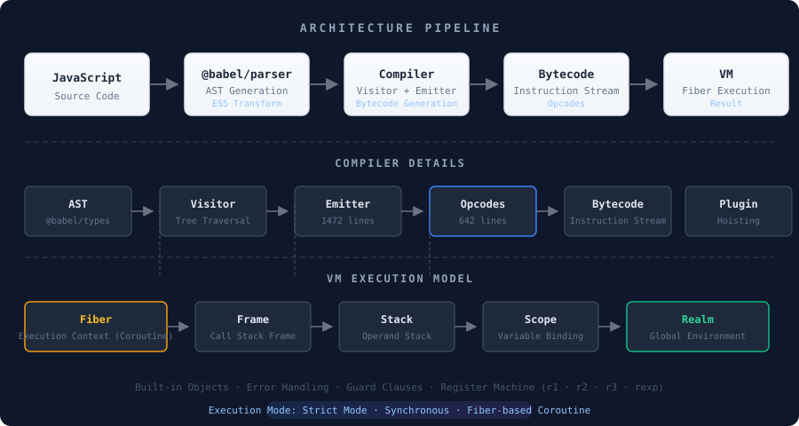
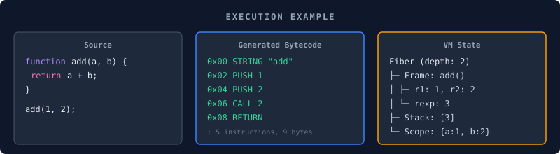
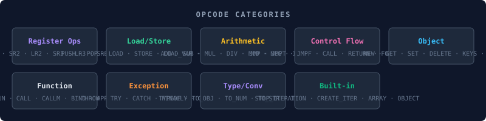
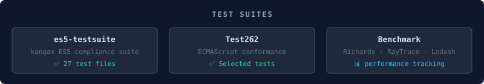

# jsvm3

[](https://github.com/ximing/jsvm3/actions/workflows/build.yml)
[](https://coveralls.io/github/ximing/jsvm2?branch=master)
[](https://www.npmjs.com/package/jsvm2)
[](https://www.npmjs.com/package/jsvm2)

> **A JavaScript Interpreter implemented in JavaScript** — runs ES5 with partial ES2015+ support.  
> Built from scratch with a custom bytecode compiler and fiber-based virtual machine.

---

## Architecture Overview



---

## How It Works

### 1. Parse

JavaScript source is parsed by `@babel/parser` into an AST, then transformed to ES5 via `@babel/preset-env`.

### 2. Compile

The [Compiler](src/compiler) traverses the AST and emits custom bytecode instructions:

| Component | File | Description |
|-----------|------|-------------|
| **Visitor** | [`visitor.ts`](src/compiler/visitor.ts) | AST tree traversal and node handling |
| **Emitter** | [`emitter.ts`](src/compiler/emitter.ts) | Bytecode emission — 1472 lines of instruction generation |
| **Opcode Map** | [`opMap.ts`](src/compiler/opMap.ts) | Maps AST node types to opcodes |
| **Plugin** | [`plugin/`](src/compiler/plugin) | Variable hoisting, ES5 transforms |
| **Utils** | [`utils.ts`](src/compiler/utils.ts) | Compiler utilities |

### 3. Execute

The [VM](src/vm) executes bytecode using a fiber-based coroutine model:



---

## Instruction Set

The custom opcode system defines over 80 instructions across several categories:



---

## Feature Support

> The engine runs in **strict mode** by default.

### ✅ ES5 — Full Support

| Category | Supported |
|----------|-----------|
| **Literals** | Null, String, Number, Boolean, RegExp, Array |
| **Statements** | Expression, Block, Empty, Debugger, Return, Labeled, Break, Continue, If, Switch, Throw, Try, For, While, DoWhile, ForIn |
| **Expressions** | Conditional, Unary, Update, Binary, Assignment, Logical, Member, Call, New, Sequence, This |
| **Declarations** | VariableDeclaration, FunctionDeclaration, FunctionExpression |
| **Patterns** | ObjectProperty, ObjectMethod, SwitchCase, CatchClause |
| **WithStatement** | ❌ *Not supported — disabled in strict mode by @babel/parser* |

### ✅ ES2015 — Partial Support

| Feature | Status |
|---------|--------|
| `let` / `const` | ✅ Block scoping |
| Arrow Functions | ✅ |
| `for...of` | ✅ |
| Spread / Rest | ✅ |
| Destructuring | ✅ Object pattern |
| Default Parameters | ✅ |
| `new.target` (MetaProperty) | ✅ |
| Template Literals | ❌ |
| Classes | ❌ |
| Generators / `yield` | ❌ |
| `import` / `export` | ❌ |

### ✅ ES2016

| Feature | Status |
|---------|--------|
| `**` (Exponentiation) | ✅ |

### 🧪 Experimental

| Feature | Status |
|---------|--------|
| DoExpression | 🚧 |
| Decorators | 🚧 |
| SpreadProperty | 🚧 |

---

## Testing

The project is verified against multiple test suites:



---

## Project Structure

```
jsvm3/
├── src/
│   ├── compiler/          # Compiler: AST → Bytecode
│   │   ├── visitor.ts     #   AST traversal
│   │   ├── emitter.ts     #   Bytecode emission (1472 lines)
│   │   ├── opMap.ts       #   AST → Opcode mapping
│   │   ├── plugin/        #   Transform plugins (hoisting, etc.)
│   │   └── utils.ts       #   Compiler utilities
│   ├── vm/                # Virtual Machine
│   │   ├── fiber.ts       #   Execution context (coroutine)
│   │   ├── frame.ts       #   Call stack frame
│   │   ├── realm.ts       #   Global environment
│   │   ├── scope.ts       #   Variable scope
│   │   ├── script.ts      #   Script loading
│   │   ├── stack.ts       #   Operand stack
│   │   ├── builtin.ts     #   Built-in objects
│   │   └── vm.ts          #   JSVM entry point
│   ├── opcodes/           # Instruction set
│   │   ├── ins.ts         #   Instruction definitions (642 lines, 80+ opcodes)
│   │   ├── op.ts          #   Object operations
│   │   ├── opIdx.ts       #   Opcode indices
│   │   ├── utils.ts       #   Opcode utilities
│   │   ├── types.ts       #   Type definitions
│   │   ├── label.ts       #   Jump labels
│   │   └── contants.ts    #   Constants
│   └── utils/             # Utilities
│       ├── convert.ts     #   JSON serialization/deserialization
│       ├── errors.ts      #   Error types
│       ├── helper.ts      #   Helpers
│       └── opcodes.ts     #   Opcode helpers
├── assets/                # Assets (SVG diagrams)
│   ├── architecture.svg
│   ├── execution.svg
│   ├── opcodes.svg
│   └── testing.svg
├── __tests__/             # Test suites
│   ├── es5/               #   ES5 tests (27 files)
│   ├── es2015/            #   ES2015 tests (7 files)
│   ├── es5-testsuite/     #   kangax compliance suite
│   └── framework/         #   Framework tests
├── benchmark/             # Performance benchmarks
│   ├── richards           #   Richards benchmark
│   └── raytrace           #   Raytrace benchmark
├── dev/                   # Development tools
└── babel/                 # Babel transform experiments
```

---

## Getting Started

```bash
# Install
pnpm install

# Build
pnpm build

# Test
pnpm test              # Run all tests
pnpm test:coverage     # With coverage report

# Development
pnpm typecheck         # TypeScript type checking
```

---

## Specification

The engine targets the **[ECMAScript 5.1 Specification](https://www.ecma-international.org/wp-content/uploads/ECMA-262_5th_edition_december_2009.pdf)** (December 2009) with selected ES2015+ features.

---

## License

MIT © ximing